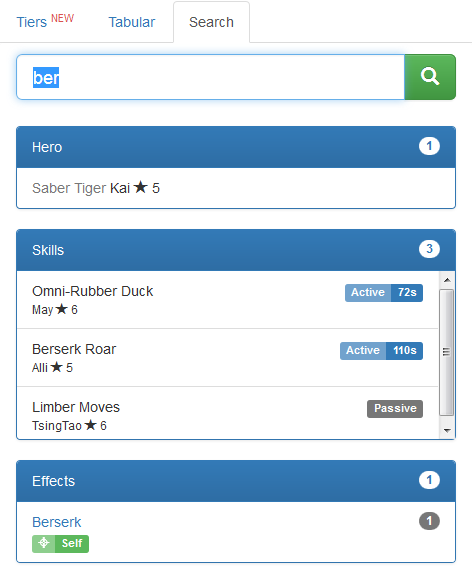
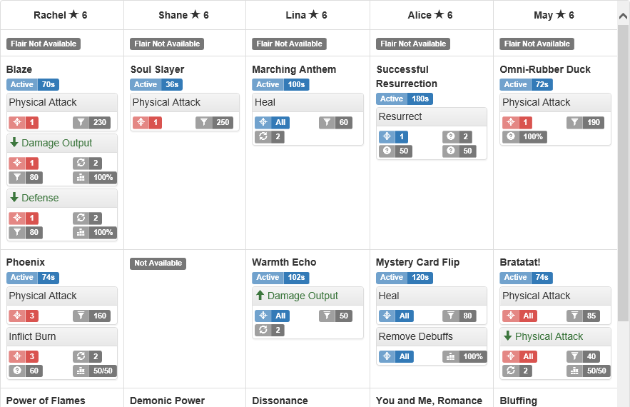
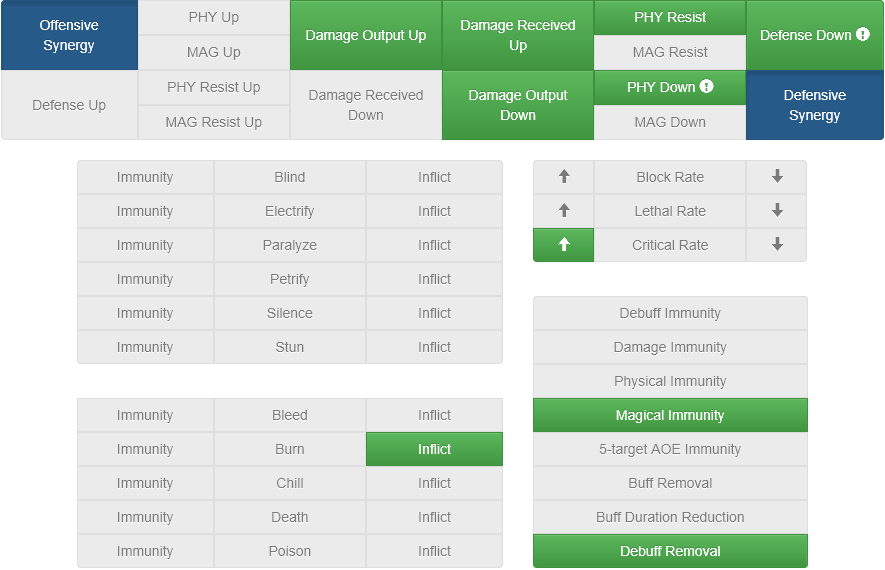

# Seven Knights Database (skdb)

Rails application demo at http://skdb.herokuapp.com

Try: http://skdb.herokuapp.com/compare/shane/lina/rachel/eileene/alice

Bugs? Problems? Use [Issue Trackers](https://github.com/gbudiman/skdb/issues)

## Screenshot

1. Search anything 

2. Compare heroes and skills 

3. Synergies and duplicates 

## Limitation
- Scoped to GA release, currently only 6* heroes
- No hero portraits yet
- No hero stats (HP, ATK/MAG, DEF, SPD)
- Some skill attributes have not been labeled properly (need to use localization instead of hardcoding)
- No support for IE (probably never will, use it at your own risk)

## Technical Specification
- Support PostgreSQL and MySQL
