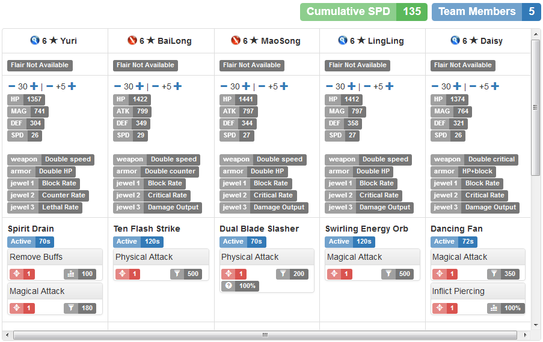

# Seven Knights Database (skdb)

Rails application demo at http://skdb.herokuapp.com

Try: http://skdb.herokuapp.com/compare/shane/lina/rachel/eileene/alice

Bugs? Problems? Use [Issue Trackers](https://github.com/gbudiman/skdb/issues)

## Screenshot

1. Search by tiers, stats, skills, effects, pretty much anything 

2. Compare heroes' skills, stats, and equip recommendations. Stats are dynamic and scaled to heroes' level and augment 

3. Synergies and duplicates 

## Limitation
- Scoped to GA release. Includes all 6* heroes and highest-tiered form for non-6* heros
- No hero portraits yet
- Some skill attributes have not been labeled properly (need to use localization instead of hardcoding)
- Need better symbols for attributes. Any designers out there?
- No small-screen (mobile-phone) support yet. Low priority as of now
- No support for IE (probably never will, use it at your own risk)

## Technical Specification
- Support PostgreSQL and MySQL
